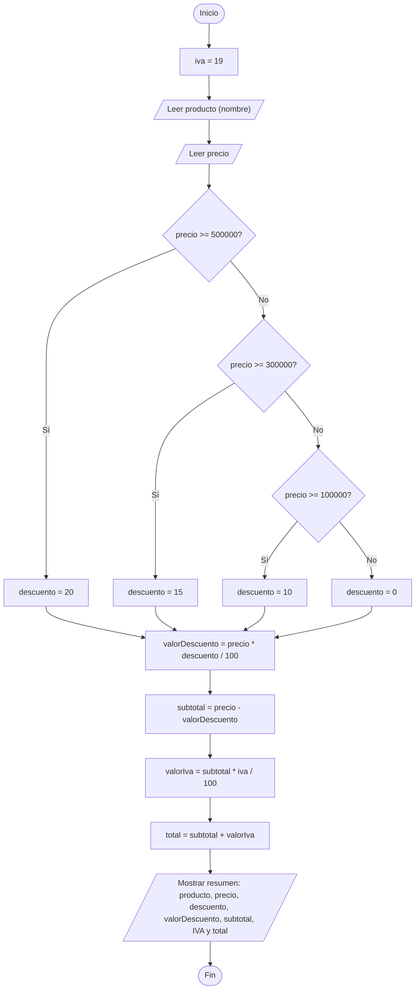

```mermaid
flowchart TD
    A([Inicio]) --> B["iva = 19"]
    B --> C[/"Leer producto (nombre)"/]
    C --> D[/"Leer precio"/]
    D --> E{"precio >= 500000?"}
 
    E -- Sí --> F["descuento = 20"]
    E -- No --> G{"precio >= 300000?"}
 
    G -- Sí --> H["descuento = 15"]
    G -- No --> I{"precio >= 100000?"}
 
    I -- Sí --> J["descuento = 10"]
    I -- No --> K["descuento = 0"]
 
    F --> L
    H --> L
    J --> L
    K --> L
 
    L["valorDescuento = precio * descuento / 100"] --> M["subtotal = precio - valorDescuento"]
    M --> N["valorIva = subtotal * iva / 100"]
    N --> O["total = subtotal + valorIva"]
    O --> P[/"Mostrar resumen: producto, precio, descuento, valorDescuento, subtotal, IVA y total"/]
    P --> Q([Fin])
```