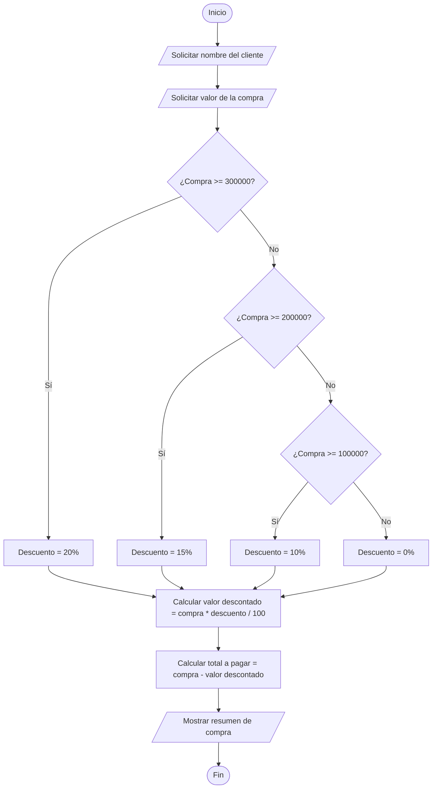

```mermaid
flowchart TD
    A([Inicio]) --> B[/Solicitar nombre del cliente/]
    B --> C[/Solicitar valor de la compra/]
    C --> D{¿Compra >= 300000?}
    D -- Sí --> E["Descuento = 20%"]
    D -- No --> F{¿Compra >= 200000?}
    F -- Sí --> G["Descuento = 15%"]
    F -- No --> H{¿Compra >= 100000?}
    H -- Sí --> I["Descuento = 10%"]
    H -- No --> J["Descuento = 0%"]
    E --> K[Calcular valor descontado = compra * descuento / 100]
    G --> K
    I --> K
    J --> K
    K --> L[Calcular total a pagar = compra - valor descontado]
    L --> M[/Mostrar resumen de compra/]
    M --> N([Fin])
```